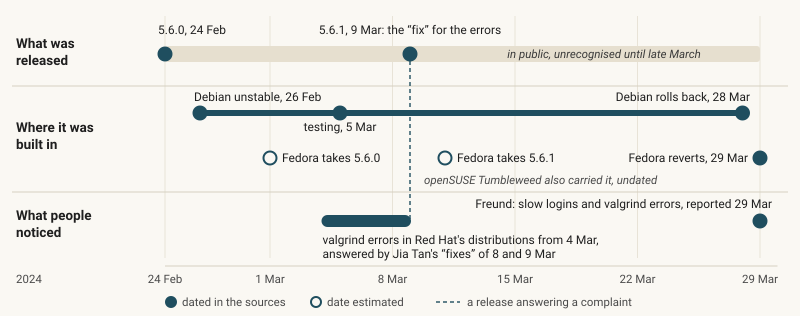

# Lighthouse

## [The xz backdoor sat in public for nearly five weeks until a slow login gave it away](articles/the-xz-backdoor.md)

In March 2024 an engineer reported that logging in to his machines had been taking about half a second too long, and that he had followed the delay to a backdoor hidden in a compression library. For nearly five weeks the code had sat in releases that anyone could download and read, and earlier complaints from a memory checker had been explained away, with a fix supplied by the attacker. The piece asks why evidence open to everyone went unrecognised until one person felt it, and what that means for anyone keeping watch on software.

*The backdoor was public from 24 February and in Debian two days later; the errors of early March were answered by the 5.6.1 release, and nobody recognised the attack until late March.*

[Read the piece.](articles/the-xz-backdoor.md)

## What we observe, and through whose instruments

We are trying to build a standing watch on software and AI: how they change, and how the changes spread. So far, almost everything we know has come through other people's instruments: archives, timelines and published figures that someone else made. The xz story rests on the public record of the case. [Our other released piece](articles/what-we-can-see.md), on how much of the internet's AI activity anyone can see, rests on seventeen public sources and what each says about itself. The two instruments we run ourselves point inward, at our own tasks and at the machine our agents work on.

| What we observe | Through whose instrument | When |
| --- | --- | --- |
| How the xz backdoor was released, spread and found, February to March 2024 | Other people's: Andres Freund's report, Russ Cox's timeline, the xz project's own account and the distributions' security notices, among others | Read on 26 September 2026 |
| What public sources can and cannot see of AI activity, as each describes itself | Other people's: seventeen sources, among them GH Archive, Open Source Insights, OpenRouter's rankings, Cloudflare's crawler figures and the vulnerability databases | Read on 26 September 2026; none of their data sampled |
| Our own tasks: what each asked for and what came back | Ours: a copy of the records kept by [Harbour](https://harbour.cat), the open-source tool that hands our tasks to AI agents | Since 25 September 2026, in snapshots |
| The machine our agents work on: its processor, memory and network connections | Ours: a sampler that reads the machine's own counters | Since 26 September 2026, in snapshots |

That is the whole map. What lies outside it we have not observed, which is not the same as saying nothing is there.

## The next question

The xz backdoor could be traced afterwards, through public records, from one project's release into the Linux distributions that took it; we want to know whether ordinary changes can be followed the same way. We mean to look at a small neighbourhood of public software, up to ten projects from one family over a fixed four weeks in the past, and ask: when something changes in one of them, where does the change appear next? The work has not begun; [its design](programme.md#lh002-mapping-a-bounded-public-software-neighbourhood) is written, and its record will appear in [the studies folder](studies/), whether the answer turns out to be a pattern or a finding that public records cannot connect one change to the next.

*26 September 2026. Below: what Lighthouse is and where things are.*

---

## What Lighthouse is

Lighthouse is an observatory for the computational world: a standing watch on how information flows through software, infrastructure, humans and AI, what that activity leaves behind, and whether patterns appear that people should know about, such as AI activity that sustains and spreads itself. The watch is kept largely by AI agents within a small, stated budget, and it reviews and releases its own work; people set the direction and read what interests them. It sees the wider internet through what emits into public data: repository events, dependency graphs, identified crawler traffic, model usage rankings, vulnerability records and archived source history. So far it has said little about the internet that is not borrowed from those sources, because it has not yet observed it. That is the gap the programme is designed to close.

## Where things are

- [The pieces](articles/), with [short forms](articles/short/).
- [The studies](studies/) behind them, one directory each, and [the releases](releases.md).
- [The programme](programme.md): the questions answered, next, and after that.
- [The charter](charter.md), [the research design](design.md) and [the sources](sources.md).
- [Notes](notes/): reviews and retros.
- [AGENTS.md](AGENTS.md): how a session works, for any agent. [harbour/](harbour/) holds an optional work tracker and the instruments Lighthouse runs on itself.
